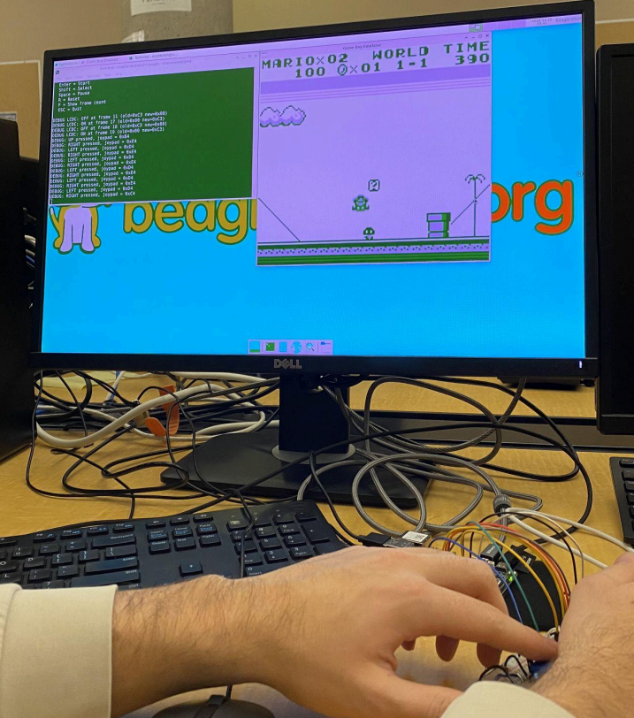
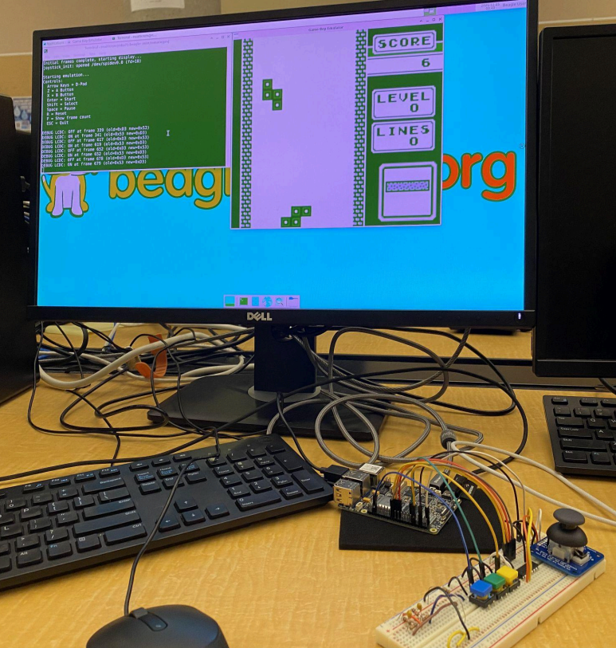

# BeagleBone Game Boy Emulator

This repository contains a Game Boy emulator written in C, designed to run both:

- Natively on a Linux host (e.g., Debian VM) with keyboard input.
- On a BeagleBone (aarch64), with optional physical button inputs via the `button_inputs` branch.

The project is structured for clean cross-compilation, testing, and hardware abstraction, and is intended as a teaching-quality embedded/graphics project.

---

## Features

- Nintendo Game Boy CPU, PPU, memory, and input emulation.
- SDL3-based GPU test harness for visual debugging.
- Hardware Abstraction Layer (HAL) for BeagleBone-specific I/O and button input.
- Separate branches for:
  - Keyboard-driven emulator on host (`main`).
  - BeagleBone physical button input (`button_inputs`).
- Unit tests and developer-focused tooling.
- Project documentation in `docs/` (architecture notes, design decisions, and setup guides).  
- Example screenshots and photos of the BeagleBone setup (see docs and repo images).

---

## Branches and Input Modes

- **`main` branch (default)**  
  - Intended for development on a desktop / VM.  
  - Emulator runs with **keyboard input** mapped to Game Boy buttons.  
  - This is the recommended branch to build and run on your Debian VM.

- **`button_inputs` branch**  
  - Intended for a BeagleBone wired with **physical buttons**.  
  - HAL is configured to read GPIO/button inputs instead of (or in addition to) keyboard events.  
  - If your BeagleBone is physically wired for buttons, **checkout this branch** before building:

    ```bash
    git checkout button_inputs
    ```

---

## Project Overview

- **Language:** C  
- **Build system:** CMake  
- **Targets:**
  - Emulator executable: `build/app/gbe`
  - Test executables: `build/tests/*`  
- **Key directories:**
  - `app/` – emulator core (CPU, PPU, memory, main, input, etc.)
  - `hal/` – hardware abstraction layer (BeagleBone, platform-specific code)
  - `tests/` – unit tests and GPU test harness
  - `cmake/` – toolchain files (e.g., `aarch64-toolchain.cmake`)
  - `docs/` – project documentation (design, architecture, setup)
  - `build*/` – out-of-source build directories (generated)

---

## Prerequisites

### Common tools (host)

```bash
sudo apt update
sudo apt install cmake build-essential gcc g++
```

### Cross-compilation toolchain (for aarch64 / BeagleBone)

To cross-compile from the Debian VM to aarch64:

```bash
sudo apt install gcc-aarch64-linux-gnu g++-aarch64-linux-gnu
```

The toolchain file at `cmake/aarch64-toolchain.cmake` configures CMake for cross-compiling. Edit it if your cross-toolchain is in a non-standard location.

---

## SDL3 Setup (GPU Test)

The `gpu_test` executable uses SDL3 for graphics. You typically want:

- **Native SDL3** on the Debian VM for desktop GPU tests.
- **Native SDL3** built on the BeagleBone for on-target GPU tests.
- **Optional cross-compiled SDL3** in `/opt/aarch64-sdl2` for cross builds.

### Native SDL3 on Debian VM

If your distro provides SDL3:

```bash
sudo apt install libsdl3-dev
```

This allows the native build to find SDL3 automatically (`find_package(SDL3 REQUIRED CONFIG)`).

### Cross-compiled SDL3 for aarch64 (host-side)

You already have `/opt/aarch64-sdl2` set up for aarch64 SDL3. That path is used only when you explicitly configure a cross build (see below).

### SDL3 on the BeagleBone

On the BeagleBone, build and install SDL3 natively so that `gpu_test` can use the board's actual video drivers.

---

## Build Instructions

This project is designed to support **two distinct build modes**:

1. Native build on the host (Debian VM, keyboard input).
2. Cross-compile for aarch64 (BeagleBone target, SDL3 from `/opt/aarch64-sdl2`).

Use separate build directories to avoid mixing configurations.

### 1. Native build (Debian VM, x86_64)

This builds an emulator that runs on your VM with **keyboard input** on the `main` branch.

```bash
# From the repo root
rm -rf build
cmake -S . -B build \
  -DCMAKE_BUILD_TYPE=Debug
cmake --build build

# Emulator binary:
ls build/app/gbe
```

Run `gbe` on the host; it will use keyboard input mapping as implemented in the `app/` layer.

### 2. Cross-compile for aarch64 (BeagleBone)

Use the toolchain file and (optionally) the aarch64 SDL3 install:

```bash
# Cross-compile emulator for aarch64
rm -rf build-aarch64
cmake -S . -B build-aarch64 \
  -DCMAKE_TOOLCHAIN_FILE=cmake/aarch64-toolchain.cmake \
  -DCMAKE_BUILD_TYPE=Release
cmake --build build-aarch64

# Emulator binary:
ls build-aarch64/app/gbe
```

To also build SDL3-based GPU tests using your cross-compiled SDL3 in `/opt/aarch64-sdl2`:

```bash
rm -rf build-aarch64
cmake -S . -B build-aarch64 \
  -DCMAKE_TOOLCHAIN_FILE=cmake/aarch64-toolchain.cmake \
  -DCMAKE_PREFIX_PATH=/opt/aarch64-sdl2 \
  -DCMAKE_BUILD_TYPE=Release
cmake --build build-aarch64
```

> Note:  
> - When **not** providing `CMAKE_TOOLCHAIN_FILE` and `CMAKE_PREFIX_PATH`, CMake builds a **native** x86_64 version and uses your system's SDL3 dev package.  
> - When you **do** provide those flags, CMake cross-compiles for aarch64 and links against the SDL3 in `/opt/aarch64-sdl2`.

---

## Running the Emulator

After building, you can run the emulator on the host with a Game Boy ROM:

```bash
./build/app/gbe rom/Dr-Mario.gb
```

Replace `rom/Dr-Mario.gb` with the path to any valid Game Boy ROM file you have locally.

On the BeagleBone (after copying the binary and ROMs):

```bash
./gbe Dr-Mario.gb
```

## NFS and Deployment Notes

- If you use NFS to share the built binary with your BeagleBone, update the commented line in `app/CMakeLists.txt` to match your NFS path.  
  - For example, change from `~/ensc-351/public/proj/gbe` to something like `~/ENSC351/public/finalproject/github` or your specific NFS mount.
- If your cross-toolchain lives in a custom prefix, either:
  - Edit `cmake/aarch64-toolchain.cmake`, or  
  - Pass `CMAKE_C_COMPILER` / `CMAKE_CXX_COMPILER` directly on the CMake command line.
- If your toolchain expects a sysroot, set `CMAKE_SYSROOT` appropriately.

---

## Running Tests

Build and run tests on the host:

```bash
cmake -S . -B build
cmake --build build

# Example:
./build/tests/cpu_test
./build/tests/gpu_test   # Requires SDL3 and a display
```

### Running GPU Test on BeagleBone

```bash
# From the host:
scp build-aarch64/tests/gpu_test debian@beagley-ai.local:~/

# On BeagleBone GUI session (HDMI + local terminal):
cd ~
./gpu_test
```

If address sanitizer is enabled and reports SDL/X11 leaks (usually benign):

```bash
export ASAN_OPTIONS=detect_leaks=0
./gpu_test
```

---

## Coding and HAL Notes

- Include HAL headers with the explicit prefix:

  ```c
  #include "hal/myfile.h"
  ```

  This makes the boundary between low-level hardware access and higher-level emulator logic clear.

- You only need to rerun the CMake configuration step when:
  - Adding/removing `.c` or `.h` files.
  - Renaming files.
  - Changing build options or toolchain.  
  For normal edit–build cycles, just run the build command (or your IDE's "build" action).

- The HAL is intentionally modular: you can swap in alternative implementations (e.g., a pure software "mock hardware" layer) to simulate BeagleBone behavior without real hardware access.

---

## Documentation and Media

- The `docs/` directory contains:
  - Technical design notes (CPU/PPU architecture, timing model).
  - Platform setup instructions.
  - Additional details useful for understanding and extending the project.

### Screenshots and Photos




---
